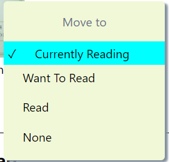

# Getting Started with Create React App

This project was launched with [Create React App](https://github.com/facebook/create-react-app).

## Available Scripts

In the project directory, you can run:
### `npm install`

Install any dependencies, necessary library for applicaion
### `npm start`

Runs the app in the development mode.\
Open [http://localhost:3000](http://localhost:3000) to view it in your browser.

The page will reload when you make changes.\
You may also see any lint errors in the console.

# Project Introduction

This project called My Read. An application manage books that have different state. It may be **want to read**, **currently read**, **read**. And also user can go through the search page to search or add a desired book to your shelf.

- Application is using React with state management to listen any changes from client to display the right part on the browser

# Project Architecture 
    *from up to down, the number bullets show organising level*
1. App.js: 
  + parent file where all custom components is called, set books is show round icon, hide read table status by default.
  + Organise routing.

2. BookDashboard.js
2. SearchPage.js
3. BookList.js
4. ReadStatus.js

# Project Feature
1. Common Feature Introduction:
  **1.1.** Show Read Table Status 
  - After go into your dashboard/ enter key to search. You also see a button like this.
  - API that Udacity provides do not exist a property for display read status, It only appears after clicking on the above button . By default, it will not be clicked on any item. If you chose a shelf and then, when open again this table, it will show a matching item with a shelf you chose before.
  - Due to non-exits properties. An idea is to create 2 property to show/hide this table/round icon.
  ```
    res.forEach(book => {
          book.isShowReadStatus = false;
          book.isShowRoundStatus = true;
        });
  ```
2. Dashboard Page

3. Search Page
- For search page, you don&apos;t need to press enter to display search result. After typing from keyboard, application will trigger an event to automatically send to server to query, receive a matching book(s) and display on search page